## Part 1. Установка ОС
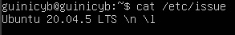\
_Вывод команды cat /etc/issue_

## Part 2. Создание пользователя
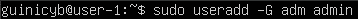\
_Команда создания пользователя_

\
_Вывод команды cat /etc/passwd_

## Part 3. Настройка сети ОС
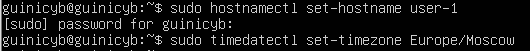\
_Задача hostname и временной зоны_

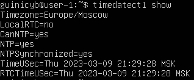\
_Проверка временной зоны_

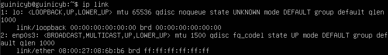\
_Вывод интерфейсов_

lo (loopback) – интерфейс, использовабщийся сетевым клиентским программным обеспечением, чтобы общаться с серверным приложением, расположенным на том же компьютере. Привязанный к интерфейсу адрес: 127.0.0.1; DNS домен: localhost.

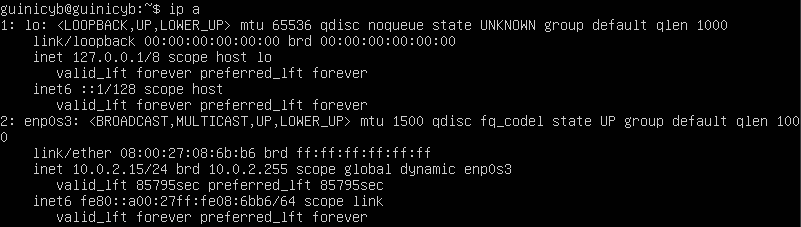\
_Внутренний IP_

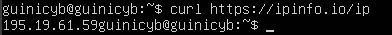\
_Внешний IP_

DHCP (Dynamic Host Configuration Protocol) -  это протокол клиента или сервера, который автоматически предоставляет узел протокола IP с его IP-адресом и другие связанные сведения о конфигурации, такие как маска подсети и шлюз по умолчанию.

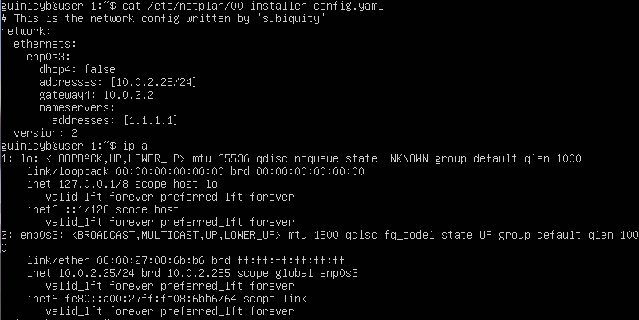\
_Изменения в конфигурации и их проверка_

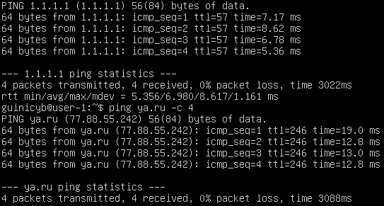\
_Пропинговка_

## Part 4. Обновление ОС
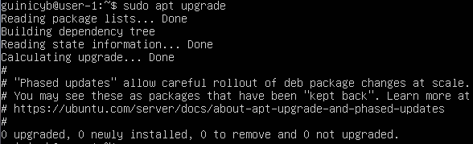\
_Вывод команды sudo apt upgrade_

## Part 5. Использование команды sudo
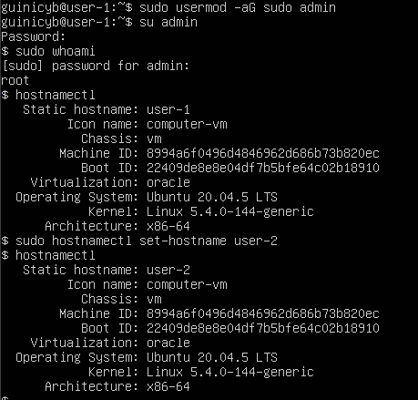\
_Использование команд с sudo и смена hostname_

Sudo - позволяет разрешенному пользователю выполнять команду как суперпользователь.
## Part 6. Установка и настройка службы времени
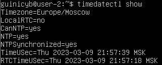\
_Проверка временной зоны_

## Part 7. Установка и использование текстовых редакторов
Использованные текстовые редакторы: Vim, JOE, nano.
| Редактор | Создание файла | Выход с сохранением | Выход без сохранения | Поиск | Замена |
|----------|----------------|---------------------|----------------------|-------|--------| 
| Vim | vim test_vim.txt | :wq | :q! | /template | %s/from_val/to_val/g |
| nano | nano test_nano.txt | ^S + ^X | ^X | ^W | ^W + ^R |
| JOE | joe test_joe.txt | ^K + W + ^K + Z | ^K + Z | ^K + F | ^K + F + R |

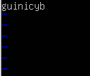\
_Запись в файл и сохранение в Vim_

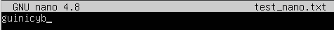\
_Запись в файл и сохранение в nano_

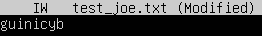\
_Запись в файл и сохранение в JOE_

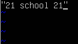\
_Запись в файл без сохранения в Vim_

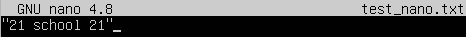\
_Запись в файл без сохранения в nano_

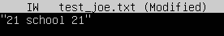\
_Запись в файл без сохранения в JOE_

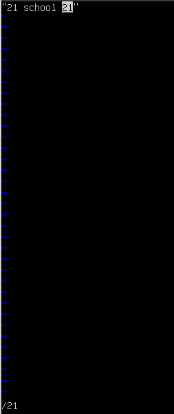\
_Поиск в Vim_

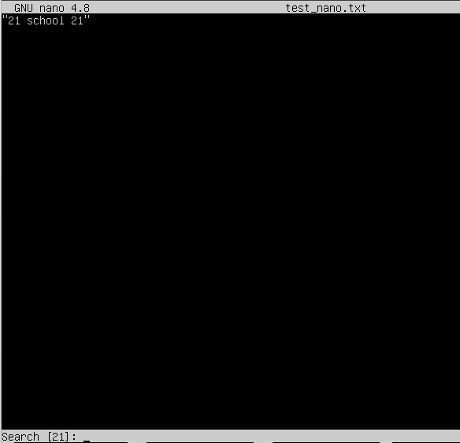\
_Поиск в nano_

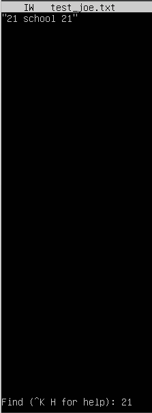\
_Поиск в JOE_

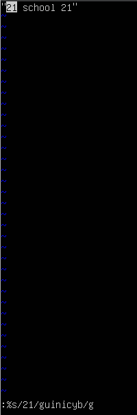\
_Замена в Vim_

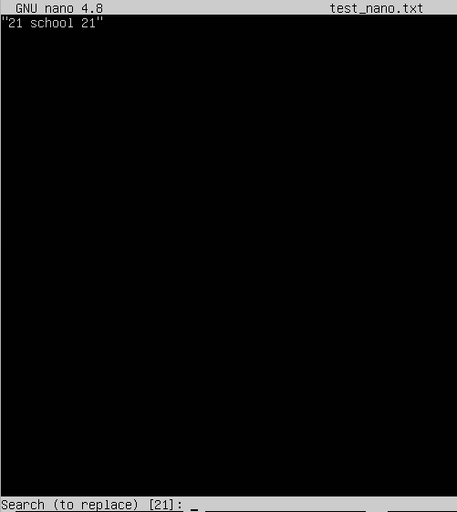\
_Замена в nano_

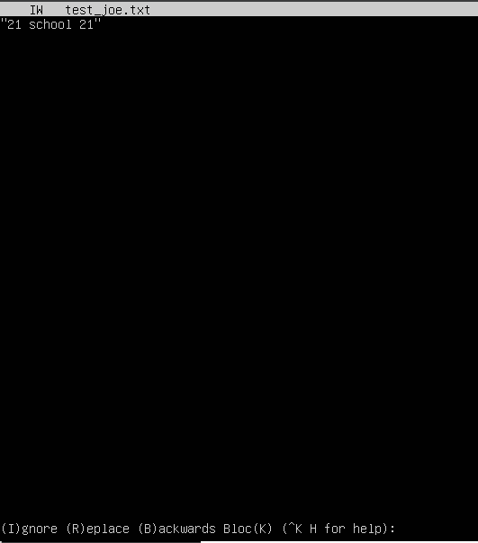\
_Замена в JOE_

## Part 8. Установка и базовая настройка сервиса SSHD
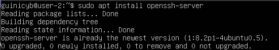\
_Установка командов sudo apt install openssh-server_

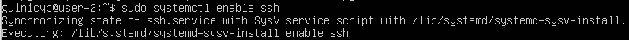\
_Автостарт службы ssh_

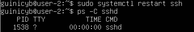\
_Проверка работы службы_

ps - команда, выводящая текущие процессы. Флаги:
- A : все процессы;
- a : процессы, связанные с текущим терминалом, а также процессы других пользователей;
- N : отрицание выбора;
- d : все процессы, кроме главных системных процессов сеанса;
- e : все процессы;
- p: только перечисленные процессы (следом указывается один или несколько PID);
- f : расширение информации;
- T : все процессы на конкретном терминале;
- r : информация только о работающих процессах;
- x : процессы, отсоединённые от терминала;
- u : выбор идентификатора(ов) эффективного пользователя;
- U : выбор идентификатора(ов) реального пользователя.
- o : позволяет определить свой формат вывода (после -o добавляем pid,comm,tty)

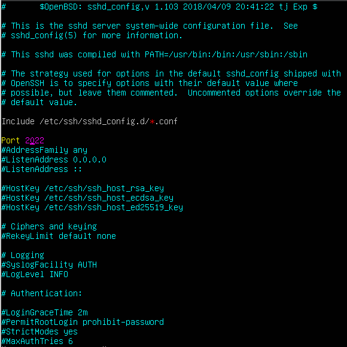\
_Смена порта с 22 на 2022_

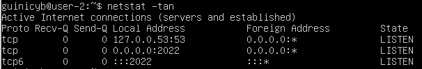\
_Проверка изменения порта_

Флаги команды netstat -tan:
- a : Отображение всех подключений и портов;
- n : Отображение адресов и портов в числовом формате;
- t : Отображение текущего подключения в состоянии переноса нагрузки с процессора на сетевой адаптер при передаче данных;

0.0.0.0 отражает, что подключение может быть выполнено на/с любой адресс.

netstat колонки:
- Proto - используемый протокол
- Recv-Q - кол-во байт, которая программа, подключенная к данному порту, не скопировала
- Send-Q - кол-во байт, неопознанных удаленным хостом
- Local Address - адресс и порт для процесса на локальном хосте
- Foreign Address - адресс и порт для процесса на удаленном хосте
- State - состояние соединения (LISTEN - готовность к установке соединения)

## Part 9. Установка и использование утилит top, htop

