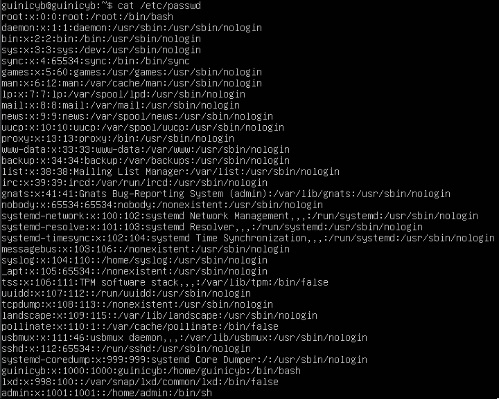

## Part 1. Установка ОС
\
_Вывод команды cat /etc/issue_

## Part 2. Создание пользователя
\
_Команда создания пользователя_

\
_Вывод команды cat /etc/passwd_

## Part 3. Настройка сети ОС
\
_Задача hostname и временной зоны_

\
_Проверка временной зоны_

\
_Вывод интерфейсов_

lo (loopback) – интерфейс, использовабщийся сетевым клиентским программным обеспечением, чтобы общаться с серверным приложением, расположенным на том же компьютере. Привязанный к интерфейсу адрес: 127.0.0.1; DNS домен: localhost.

\
_Внутренний IP_

\
_Внешний IP_

DHCP (Dynamic Host Configuration Protocol) -  это протокол клиента или сервера, который автоматически предоставляет узел протокола IP с его IP-адресом и другие связанные сведения о конфигурации, такие как маска подсети и шлюз по умолчанию.

\
_Изменения в конфигурации и их проверка_

\
_Пропинговка_

